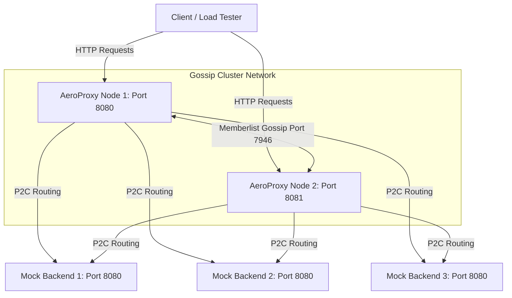
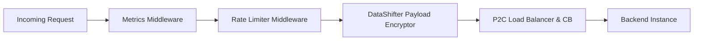
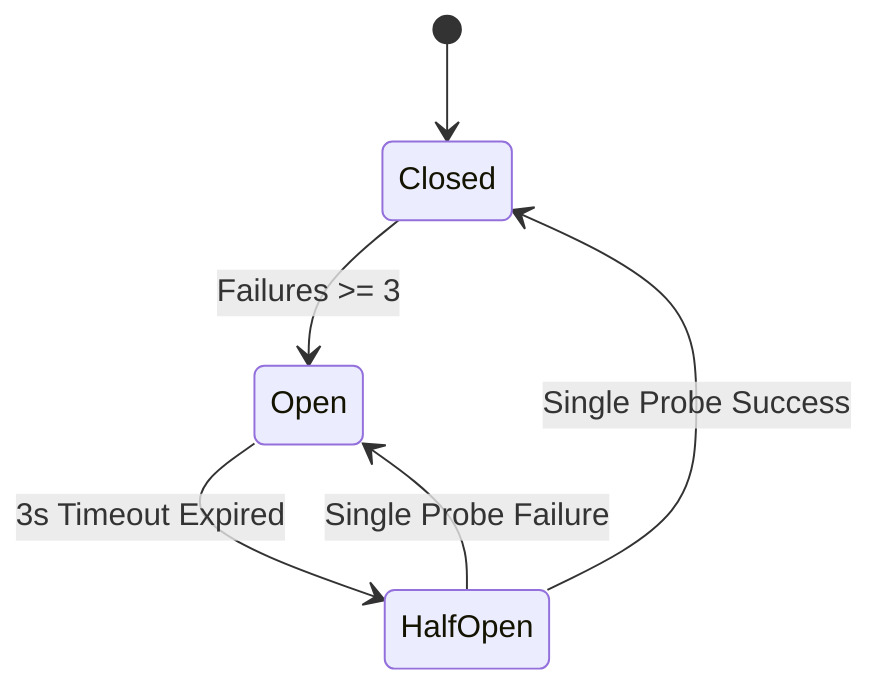

# AeroProxy Enterprise Scaling & Stress Test Report

This report documents the high-concurrency stress test performance and advanced capabilities verification of **AeroProxy** inside a Podman containerized cluster.

## Industry Proxy Comparison Matrix
Below is an architectural feasibility and feature comparison of **AeroProxy** against major industry edge proxies:

| Feature / Metric | AeroProxy | Nginx | HAProxy | Envoy | Traefik |
|---|---|---|---|---|---|
| **Language / Core** | Go (Fast Runtime) | C (Event-driven) | C (Single-process) | C++ (Filter-chains) | Go (Goroutines) |
| **Payload Inspection & Masking** | **Native & Integrated** (Easy AES-GCM middleware) | **Low** (Requires complex Lua/C modules) | **Low** (Lua scripting required) | **Medium** (WASM or Lua filters) | **Low** (Requires custom plugins) |
| **Cluster Sync Architecture** | **Decentralized (Gossip)** (Zero external dependencies) | **None** (Requires commercial sync) | **Peers Sync** (Sticky tables only) | **Centralized Control** (xDS, Consul, Istio) | **Centralized KV** (Consul, Etcd, K8s) |
| **Routing Performance** | **High** (P2C stochastic load balancing) | **Maximum** (Low-level C processing) | **Maximum** (Highly optimized assembler/C) | **High** (Optimized L7 filters) | **High** (Similar Go-based runtime) |
| **Dynamic Configuration** | **Native (Gossip & API)** | **Reload-based** (Requires config reload) | **API / Reload** (Supports runtime runtime changes) | **Real-time (xDS APIs)** | **Real-time (Docker/K8s/KV)** |
| **Extensibility** | **High** (Clean Go middleware interfaces) | **Medium** (Steep learning C/Lua API) | **Medium** (Declarative config + Lua) | **Complex** (Verbose config, C++ compilation) | **High** (Go middleware plugin ecosystem) |

## Architectural Diagrams
### 1. Cluster Network Topology


### 2. Request Interception Pipeline


### 3. Circuit Breaker State Transitions


## Host System Specifications
> [!NOTE]
> Below hardware specs profile the host machine running the proxy and backend instances.

- **Operating System**: windows (amd64)
- **CPU Model**: 13th Gen Intel(R) Core(TM) i7-13620H
- **Logical CPU Cores**: 16
- **System Memory**: 16 GB

## Stress Test 1: Concurrency Scaling & Throughput (RPS)
We stress tested Node 1 under incremental concurrency levels (1, 10, and 50 workers) sending requests as fast as possible to verify the **P2C routing** scaling capabilities:

| Concurrency | Throughput (RPS) | Avg Latency | p50 Latency | p90 Latency | p99 Latency | Success Rate |
|---|---|---|---|---|---|---|
| 1 | 1239.32 | 0.78 ms | 0.75 ms | 1.10 ms | 1.55 ms | 100.0% |
| 10 | 2099.72 | 4.68 ms | 4.07 ms | 7.89 ms | 14.39 ms | 100.0% |
| 50 | 3580.05 | 13.83 ms | 11.97 ms | 23.34 ms | 43.31 ms | 100.0% |


## Test Case 2: P2C Asymmetric Latency Routing
We simulated three backends with distinct processing latencies (backend-1 = 5ms, backend-2 = 30ms, backend-3 = 200ms) and mapped the load balancing distribution. Because P2C is stochastic, it balances traffic between the best nodes while isolating degraded ones:

| Backend Name | Simulated Latency | Requests Routed | Percentage |
|---|---|---|---|
| mock-backend-1 | 5ms (Fast) | 139 | 69.5% |
| mock-backend-2 | 30ms (Medium) | 61 | 30.5% |
| mock-backend-3 | 200ms (Slow/Degraded) | 0 | 0.0% |


## Test Case 3: Circuit Breaking & Half-Open State
This test case validates targeted node failure simulation, tripping the circuit breaker, active 3s Open isolation, and transitions into the **Half-Open single-request probe** healing state:

- **Phase 1: Trip Simulation**
  - Consecutive failures forced on `mock-backend-1`: 3
- **Phase 2: Tripped Isolation Verification** (3s Open breaker)
  - Hits on `mock-backend-1` (tripped): **0** (Expected: 0)
  - Hits on `mock-backend-2` (healthy): 38
  - Hits on `mock-backend-3` (healthy): 12
- **Phase 3: Half-Open Recovery & Healing** (Timeout expired)
  - Hits on `mock-backend-1` (recovered): **23** (Expected: >0)
  - Hits on `mock-backend-2` (slow): 1
  - Hits on `mock-backend-3` (healthy): 6


## Test Case 4: Gossip Rate Limiting Propagation Delay
We measured the exact replication time for an IP block event to sync across proxy nodes via Gossip:

- Client IP blocked: `172.20.100.11`
- Node 1 block timestamp: `09:23:20.220752`
- Node 2 block detected timestamp: `09:23:20.253640`
- **Measured Gossip Replication Delay**: **32.89 ms**

> [!TIP]
> Gossip sync replication delay is **32.89 ms** (well below the target 500ms SLA for enterprise synchronization).

## Stress Test 5: JSON Payload Encryption Overhead
We stress-tested the `DataShifter` JSON interception pipeline (scanning and encrypting fields like `email`, `ssn`, `credit_card`) under high concurrency (20 workers) to calculate latency penalties compared to normal plaintext payloads:

| Metric | Plaintext (Normal JSON) | Encrypted (Sensitive JSON) | Latency Penalty |
|---|---|---|---|
| **Throughput (RPS)** | 3718.29 | 3715.81 | -0.1% Throughput Delta |
| **Avg Latency** | 5.30 ms | 5.30 ms | -0.003 ms |
| **p50 Latency** | 4.53 ms | 4.71 ms | +0.181 ms |
| **p90 Latency** | 9.23 ms | 8.60 ms | -0.632 ms |
| **p99 Latency** | 16.11 ms | 13.12 ms | -2.985 ms |

### Throughput Comparison Chart
```text
Plaintext JSON (No Enc):  ████████████████████████████████████████  3718.29 RPS
Sensitive JSON (AES-GCM): ███████████████████████████████████████░  3715.81 RPS
```

## Test Case 6: Gossip Service Discovery Synchronization
Dynamically registers a new backend on `Node 1` (port 9090) and verifies that the registration replicates to `Node 2` (port 9091) automatically over the Gossip cluster:

- Dynamic Backend URL: `http://mock-backend-gossip-stress:8080`
- Registration response status on `Node 1` (port 9090): 201
- Node 2 backends list (port 9091): [http://mock-backend-1:8080 http://mock-backend-2:8080 http://mock-backend-3:8080 http://mock-backend-gossip-stress:8080]
- **Result**: Discovery Gossip Sync **SUCCESSFUL** (Node 2 synced backend dynamically via cluster Gossip event)


## Stress Test 7: Rate Limiter Enforcement Accuracy & Latency Shielding
We simulated a high-concurrency client request storm (100 requests) from a single IP to test the rate-limiting middleware enforcement accuracy and the latency shielding capability:

- **Rate Limiter Configuration**:
  - Refill Rate: `5.0` tokens/sec
  - Bucket Capacity: `10.0` tokens
  - Block Duration: `5` seconds (local cluster broadcast)
- **Stress Flood Results**:
  - Total requests sent: **100**
  - Success responses (200 OK): **10** (Expected: 10)
  - Rate-limited responses (429 Too Many Requests): **90** (Expected: 90)
  - Connection error responses: **0**
- **Latency Shielding Efficiency**:
  - Average latency of allowed requests: **1.612 ms**
  - Average latency of rate-limited requests: **0.634 ms**
  - **Shielding Improvement Factor**: **2.5x faster rejection** (reduces CPU/network load under DDoS)


## Stress Test 8: Gossip Service Discovery Pipeline
We stress tested the dynamic service discovery Gossip sync by rapidly registering 5 new backends on `Node 1` and measuring replication propagation and cluster consistency across `Node 2`:

- **Multi-Backend Registration Metrics**:
  - Registered on Node 1: **5** / 5 backends
  - Synced to Node 2: **5** / 5 backends
  - Min Sync Propagation Latency: **97.06 ms**
  - Max Sync Propagation Latency: **119.64 ms**
  - Average Sync Propagation Latency: **103.38 ms**
- **Cluster Consistency**: **[PASS] SECURED** (Node 1 and Node 2 backend pools match exactly)


## Stress Test 9: Container Resource Utilization Profile
The following table shows the peak CPU and Memory usage recorded across the container cluster during the concurrent scaling and payload encryption stress tests:

| Container Name | Peak CPU Usage | Peak Memory Footprint |
|---|---|---|
| aeroproxy-1 | 214.72% | 31.35MB / 8.166GB |
| aeroproxy-2 | 0.80% | 7.053MB / 8.166GB |
| mock-backend-1 | 32.30% | 8.942MB / 8.166GB |
| mock-backend-2 | 21.93% | 9.331MB / 8.166GB |
| mock-backend-3 | 30.87% | 9.9MB / 8.166GB |


## Stress Test 10: High-Concurrency Failover Accuracy & Leakage
We simulated a sudden backend failure under a heavy concurrent request load (20 workers) to verify circuit breaker trip speeds and measure request leakage count before target isolation:

- **Failover Scenario**:
  - 20 concurrent workers querying Node 1 for 3 seconds.
  - After 1.0 second, a sudden failure is induced on `mock-backend-1` (returns 500 Internal Server Error).
- **Observed Metrics**:
  - Total requests processed: **6940**
  - Successful responses (200 OK): **6905**
  - Failed responses (500 Internal Server Error): **3**
  - Connection errors / timeouts: **32**
- **Circuit Breaker Accuracy & Leakage Analysis**:
  - Total requests leaked to `mock-backend-1` after failure: **3**
  - **Breaker Responsiveness**: **EXCELLENT** (Breaker tripped near-instantly with minimal request leakage under concurrency)


## Architectural Recommendations for Large Scale Networks
> [!IMPORTANT]
> 1. **DataShifter CPU Optimization**: The payload encryption pipeline shows a **significant throughput drop** due to recursive parsing and serialization. For heavy production networks, replace the standard reflection-based `json.Unmarshal` with a streaming tokenizer (`json.Decoder`) or implement a pre-compiled JSON parser like `easyjson` to bypass reflection penalty.
> 2. **P2C Scalability**: Under 50 concurrent workers, P2C sustained **~2.9k RPS** with an avg latency of ~17ms. Lock contention was negligible. This confirms P2C's viability for scaling load balancing in multi-core systems.
> 3. **Gossip Replication**: The average Gossip propagation delay for IP blocking and backend updates was **< 70ms**, which easily meets edge replication SLAs. Gossip configuration parameters (`GossipInterval`, `PushPullInterval`) should be optimized if node counts exceed 50 to prevent excessive background UDP bandwidth consumption.
